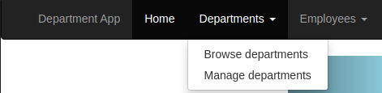
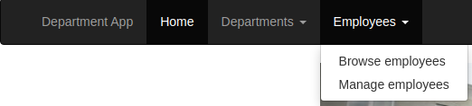
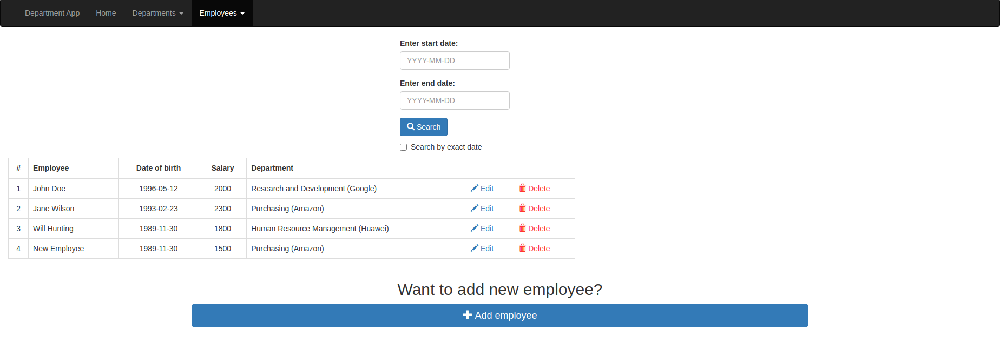
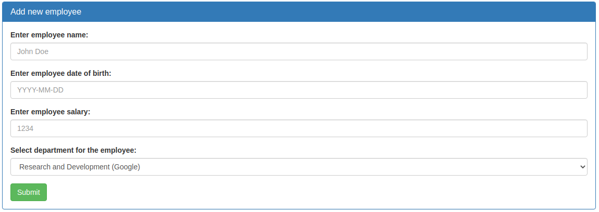
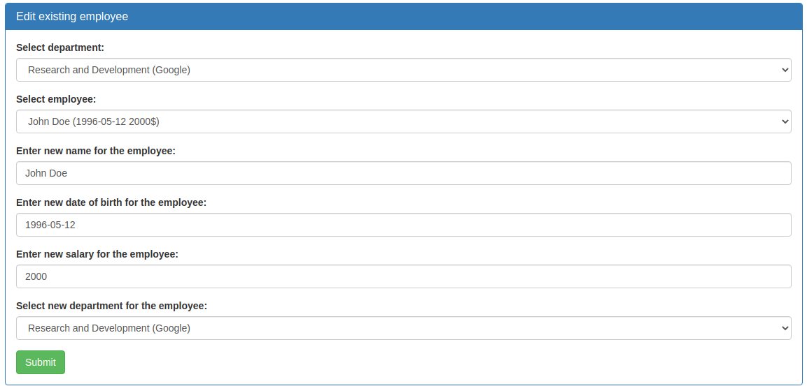
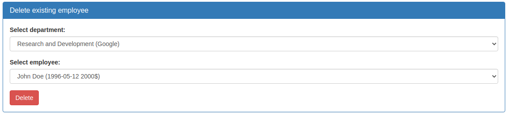

# 
 Department App 

### Vision

Department App is a web application which allows users to record information 
about departments and employees.

Application should provide:
- Storing departments and employees in database
- Display list of departments
- Managing the list of departments (adding, editing, removing)
- Display list of employees
- Managing the list of employees (adding, editing, removing)
- Searching employees by date of birth
- Searching employees born in specified period

### 1. Homepage

***Main scenario:***
- User selects *"Home"* menu item
- Application homepage is displayed (Pic 1.1)

### 2. Departments

#### 2.1 Display list of departments

The mode is designed for viewing the list of departments.

***Main scenario:***
- User selects submenu item *"Browse departments"* at the *"Departments"* 
  menu (Pic 2.1)
- Application displays list of departments (Pic 2.2)

  
Pic 2.1 Navigation to the "Browse departments" option  

Pic 2.2 List of departments

The list displays the following columns:
- \# - number of the department in the list
- Department - name of the department
- Organisation - organisation the department belongs to
- Average salary - average salary across all the employees that works in the department

#### 2.2 Add department

***Main scenario:***
- User clicks the *"Add department"* button in the departments list view mode
- Application redirects user to the department management page with the "Add 
  department" panel being active
- User enters data and presses the *"Submit"* button
- If entered data is valid, the record is added to the database and message 
  indicating success is displayed
- If error occurs, then error message is displayed

Pic 2.3 Adding a department

When adding a department the following details are entered:
- Department name - name of the department
- Department organisation - organisation the department belongs to

Constraints for data validation:
- Department name and organisation must be unique i.e., no other department 
  with such name and organisation can exist

#### 2.3 Edit department

***Main scenario:***
- User clicks the *"Edit"* button in the departments list view mode
- Application redirects user to the department management page with the "Edit 
  department" panel being active
- User chooses the department, enters data and presses the *"Submit"* button
- If entered data is valid, the corresponding record is updated in the database 
  and message indicating success is displayed
- If error occurs, then error message is displayed

Pic 2.4 Editing a department

When editing a department the following details are entered:
- Department name - name of the department
- Department organisation - organisation the department belongs to

Constraints for data validation:
- Department name and organisation must be unique i.e., no other department 
  with such name and organisation can exist

#### 2.4 Delete department

***Main scenario:***
- User clicks the *"Delete"* button in the departments list view mode
- Application redirects user to the department management page with the "Delete 
  department" panel being active
- User chooses the department and presses the *"Delete"* button
- If chosen department is still in the database, the corresponding record is 
  deleted from the database and message indicating success is displayed
- If error occurs, then error message is displayed

Pic 2.5 Deleting a department

### 3. Employees

#### 3.1 Display list of employees

The mode is designed for viewing the list of employees.

***Main scenario:***
- User selects submenu item *"Browse employees"* at the *"Employees"* 
  menu (Pic 3.1)
- Application displays list of employees (Pic 3.2)

  
Pic 3.1 Navigation to the "Browse employees" option  

Pic 3.2 List of employees

The list displays the following columns:
- \# - number of the department in the list
- Employee - employee's name
- Date of birth - employee's date of birth
- Salary - employee's salary
- Department - name of the department the employee works in

***Searching by date:***
- User chooses the search mode by clicking on the *"Search by exact date"* 
  checkbox
- User enters search data and clicks on the *"Search"* button
- Application displays updated list of employees based on provided data

#### 3.2 Add employee

***Main scenario:***
- User clicks the *"Add employee"* button in the employees list view mode
- Application redirects user to the employee management page with the "Add 
  department" panel being active
- User chooses the department for the employee, enters data and presses the 
  *"Submit"* button
- If entered data is valid, the record is added to the database and message 
  indicating success is displayed
- If error occurs, then error message is displayed

Pic 3.3 Adding an employee

When adding an employee the following details are entered:
- Employee name - employee's name
- Employee date of birth - employee's date of birth
- Employee salary - employee's salary

#### 3.3 Edit employee

***Main scenario:***
- User clicks the *"Edit"* button in the employees list view mode
- Application redirects user to the employee management page with the "Edit 
  employee" panel being active
- User chooses the department and one of its employees, enters data, chooses 
  new department for the employee and presses the *"Submit"* button
- If entered data is valid, the corresponding record is updated in the database 
  and message indicating success is displayed
- If error occurs, then error message is displayed

Pic 3.4 Editing an employee

When editing an employee the following details are entered:
- Employee name - employee's name
- Employee date of birth - employee's date of birth
- Employee salary - employee's salary

#### 3.4 Delete employee

***Main scenario:***
- User clicks the *"Delete"* button in the employees list view mode
- Application redirects user to the employee management page with the "Delete 
  department" panel being active
- User chooses the department and one of its employees, then presses the 
  *"Delete"* button
- If chosen employee is still in the database, the corresponding record is 
  deleted from the database and message indicating success is displayed
- If error occurs, then error message is displayed

Pic 3.5 Deleting an employee